<h1 align="center">
   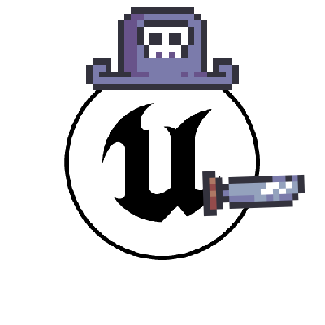
   Captain2D Platformer 
</h1>

<h4 align="center">Simple 2D project developed in Unreal Engine 5.2 using PaperZD and Blueprints.</h4>

  <a href="#objective">Objective</a> •
  <a href="#technologies">Technologies</a> •
  <a href="#widgets">Widgets</a> •
  <a href="https://github.com/HenriqueCacerez/captain2D-platformer-UE5/archive/refs/heads/main.zip">Download</a> •
  <a href="#credits">Credits</a>

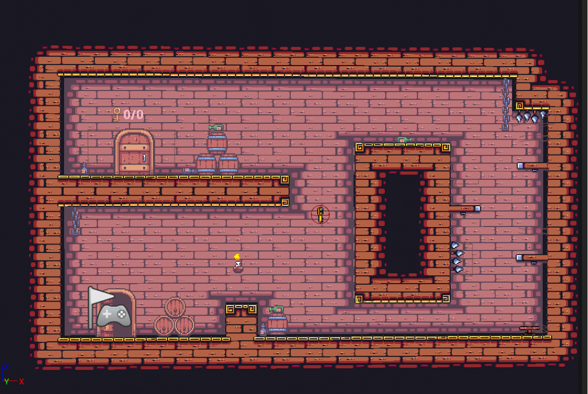

> **Notice**: This is my first project in Unreal Engine. I intend to improve it as I learn to use the engine. 
>You are more than welcome to help me enhance this project, especially if you also want to venture into the world of 2D games in Unreal Engine

## Objective:

Your goal is to find all the keys scattered throughout the map to unlock the door and advance to the next level. Each level will have its own difficulty and a different number of keys to be collected.

## Technologies:

- [Paper2D](https://docs.unrealengine.com/5.2/en-US/paper-2d-in-unreal-engine)
- [PaperZD](https://www.unrealengine.com/marketplace/en-US/product/paperzd)
- 100% [Blueprints](https://docs.unrealengine.com/5.2/en-US/introduction-to-blueprints-visual-scripting-in-unreal-engine)
- Unreal Engine [5.2](https://www.unrealengine.com/en-US/blog/unreal-engine-5-2-is-now-available)

***

## Widgets

| Image | Description |
| --- | --- |
| 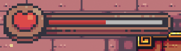 | Player's life based on health bar |
| 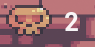 | Number of times the player has died |
| 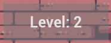 | Player's current level |
| 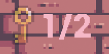 | Collected keys / Total keys |

***

## Creating New Levels

You can find all the levels in the "*Maps*" directory.

To create a new level, simply create a new map and follow the numerical sequence of the existing levels. For example, name them as "**LEVEL_6**," "**LEVEL_7**," and so on. This will ensure that the player is automatically teleported to the corresponding next level.

Remember that it's important for the level you create to have a name starting with "**LEVEL_**" (all in uppercase) followed by the level number.

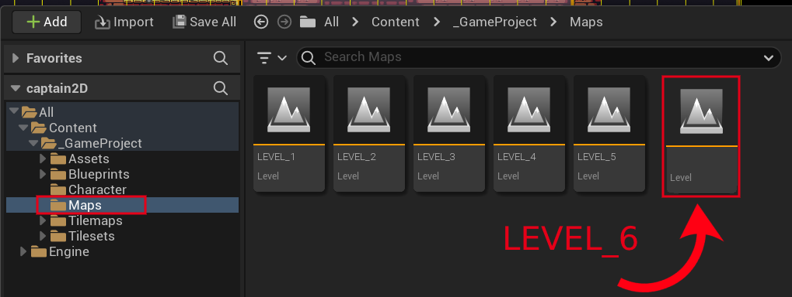

***

## Traps (Saw)

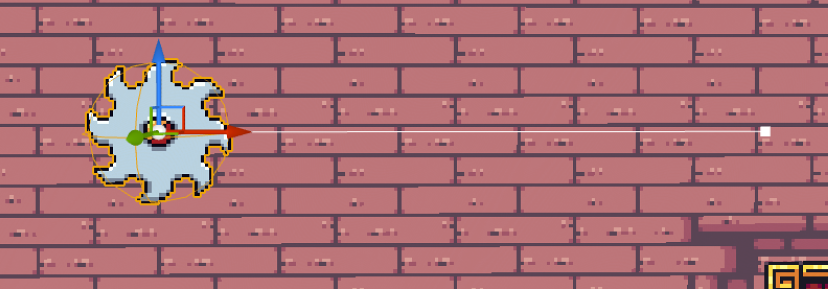

- **1.** Place the trap anywhere in the level.
- **2.** Click on it and open the "**Details**" window.
- **3.** In "*Details*", find the "**Default**" option and customize it according to your preference.

| Variable | Type | Description |
| --- | --- | --- |
| **`Loop?`** | Boolean | If true, the trap will return to its initial position when it reaches the end of the path and vice versa. |
| **`Spline Movement Duration`** | Float | Set the time, in seconds, that the trap will take to complete its trajectory. |
| **`Player Damage Value`** | Float | Damage the player will take upon touching the trap. |

***

## Setting the number of keys 🔑

To define the quantity of keys the player will need to collect to open the door is quite simple. Just place the keys somewhere in the level (it can be as many keys as you want). When you start the level, the count of keys created in the level will be automatically done through the "**BP_DoorLevel**" class.

***

## PaperZD

The "PaperZD" plugin was used to perform player animations.

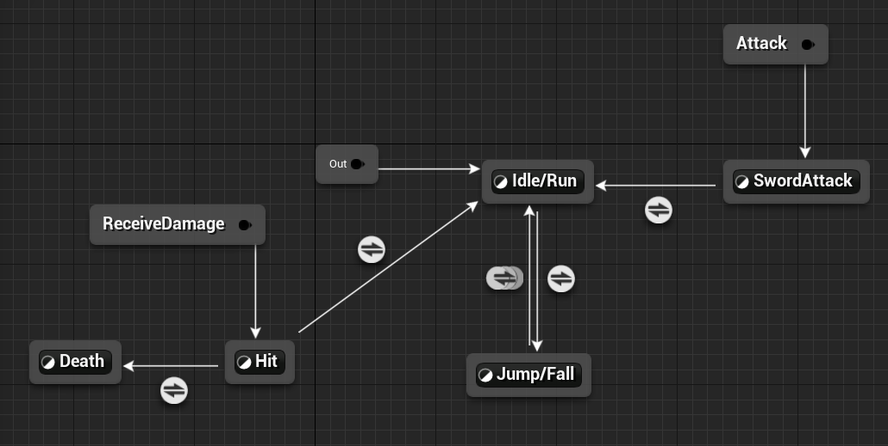

***

## Lever (Interaction)

In level 3, you will come across a lever that can interact with the environment, opening a passage.

However, you can also use it to interact with one or several characters in the environment. This is completely customizable without the need to create a new class for each interaction.

To do this, go to the actor class you want the lever to interact with. Add the "**leverInteract**" tag.

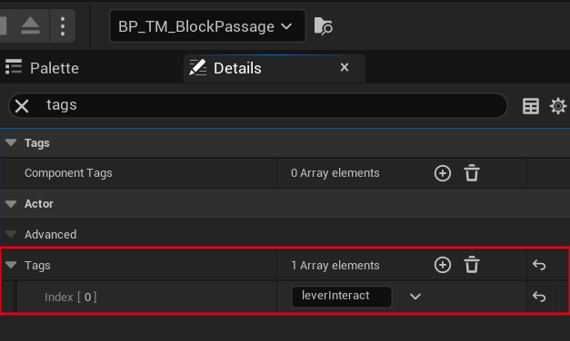

Next, create a new function also named "**leverInteract**"

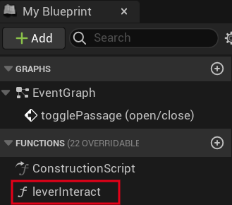

Inside this function, you can define what will happen when the lever is triggered.

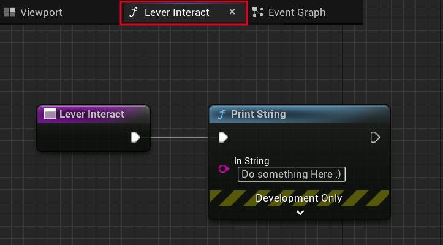

Then, to link the lever to one or several specific actors, place the lever somewhere in the level and, in the detailed settings, look for "**`Actors interacting with the Lever`**." Add the classes that will be called when someone interacts with this specific lever.

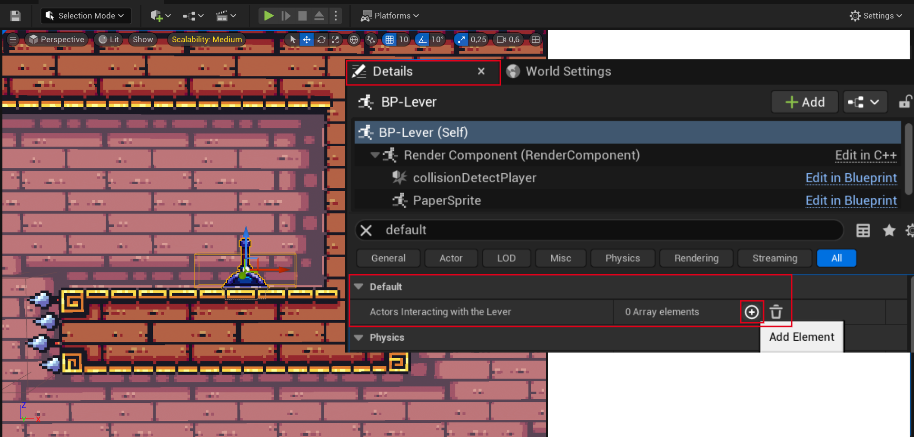

***

## Download

Download this project and open it by clicking on the "captain2D.uproject" file.

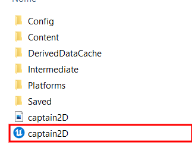

***

## Credits:

Pixel Frog's art, which is freely available on itch.io, was used in the creation of this project.

<table>
  <tr>
    <td align="center">
      <a href="https://pixelfrog-assets.itch.io/">
         
        
          <b>Pixel Frog</b> 
      </a>
          <b>Assets</b>
        
    </td>
  </tr>
</table>